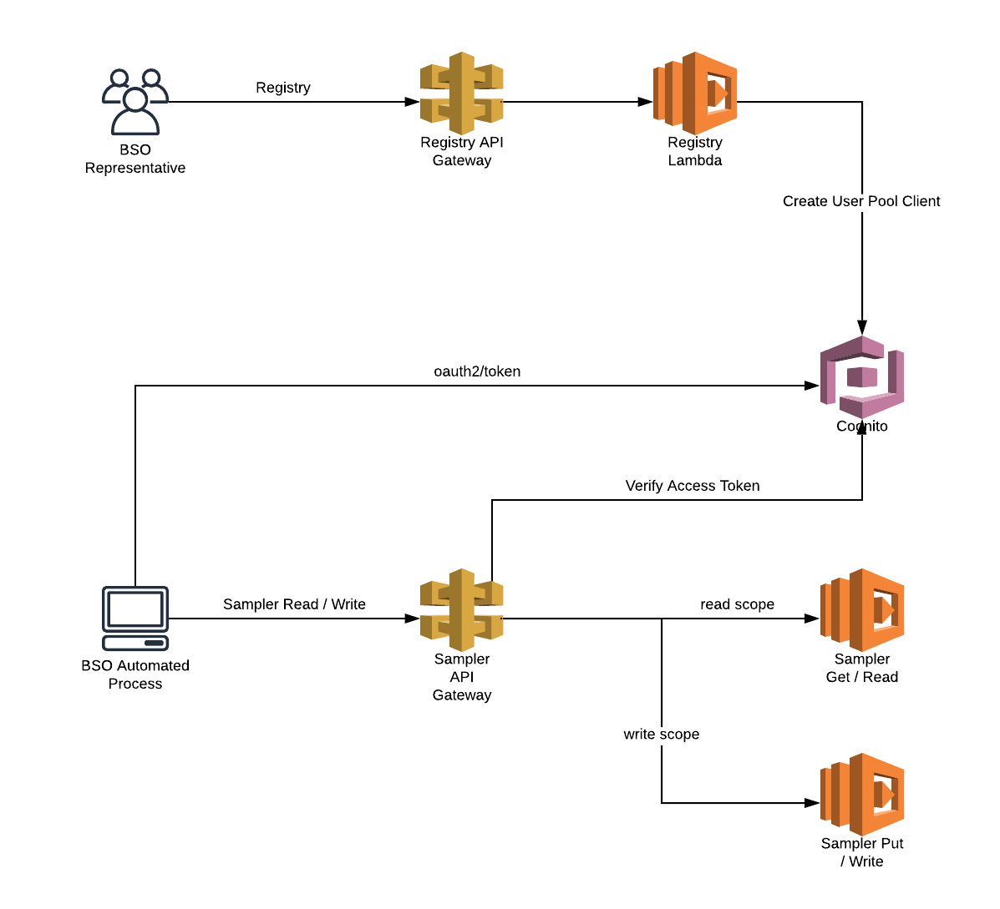

# auth-api
This is a proof of concept aimed at demonstrating the viability of a cognito based machine to machine authentication flow.



## Deployment

### Dockerized workspace
The following deployment steps may be executed via the `run-docker-shell.sh` script. This of course assumes that you have access to a bash shell.

### Build source
Run `mvn clean package`

### Stand up api gateway and cognito
You must be authenticated for command line access. In order to ensure the capability to properly modify / destroy all stack managed artifacts you will need to specify the arn of an iam role / user with sufficient grants.

```
CREATOR_IAM_ARN="arn:aws:iam::[account id]:role/[role name]" serverless deploy --stage dev --verbose -p ./stack-info
```

### Once deployment completes...
you should see helpful endpoint information included in the output.

i.e.
```
endpoints:
  PUT - https://01tm3syydf.execute-api.us-east-1.amazonaws.com/dev/v1/registration
  GET - https://01tm3syydf.execute-api.us-east-1.amazonaws.com/dev/v1/sampler
  POST - https://01tm3syydf.execute-api.us-east-1.amazonaws.com/dev/v1/sampler
...
Stack Outputs
UserPoolDomain: ...
```

to view it again run `serverless info --stage dev --verbose`

### Verbose stack output `-p ./stack-info`
If you deploy as suggested above you'll be able to review detailed cloudformation stack information in the `./stack-info` directory.

## User pool client id registry and usage

### Register a user pool client
Request:
```
curl --request PUT \
  --url https://[API ID].execute-api.us-east-1.amazonaws.com/dev/v1/registration \
  --header 'accept: */*' \
  --data '{
	"clientName": "AnOrg"
}'
```

Response:
```
{
  "message": "You are now registered",
  "input": {
    "userPoolId": "us-east-1_...",
    "clientName": "AnOrg",
    "clientId": "65ssg...",
    "clientSecret": "14t5id72e19vp...",
    ...
    "allowedOAuthFlows": [
      "client_credentials"
    ],
    "allowedOAuthScopes": [
      "auth-dev-user-pool-resource-server/write",
      "auth-dev-user-pool-resource-server/read"
    ]
    ...
  }
}
```

### Get access token
Base64 encode credentials for token retrieval
```
ENCODED_CREDS=$(echo -n [clientId]:[clientSecret] | openssl base64)
```

### Authenticate specifying the `client_credentials` grant type.

```
curl --request POST \
  --url https://auth-dev-user-pool-domain.auth.us-east-1.amazoncognito.com/oauth2/token \
  --header "authorization: Basic ${ENCODED_CREDS}" \
  --header 'content-type: application/x-www-form-urlencoded' \
  --cookie XSRF-TOKEN=31bbf552-51e2-4386-b93c-c890adc35cc4 \
  --data grant_type=client_credentials \
  --data scope=auth-dev-user-pool-resource-server/read
```

#### Note: this poc supports read and write scopes out of the box. Either or both may be specified during authentication.

i.e. 
```
--data scope=auth-dev-user-pool-resource-server/read
```

```
--data scope=auth-dev-user-pool-resource-server/write
```

```
--data scope=auth-dev-user-pool-resource-server/read auth-dev-user-pool-resource-server/write
```

### Access write endpoint

```
curl --request POST \
  --url https://[API ID].execute-api.us-east-1.amazonaws.com/dev/v1/sampler \
  --header 'authorization: Bearer [Access Token]'
```

### Access read endpoint

```
curl --request GET \
  --url https://[API ID].execute-api.us-east-1.amazonaws.com/dev/v1/sampler \
  --header 'authorization: Bearer 
  [Access Token]'
```

### More information on this oauth flow may be found [here](https://aws.amazon.com/blogs/mobile/understanding-amazon-cognito-user-pool-oauth-2-0-grants/).


